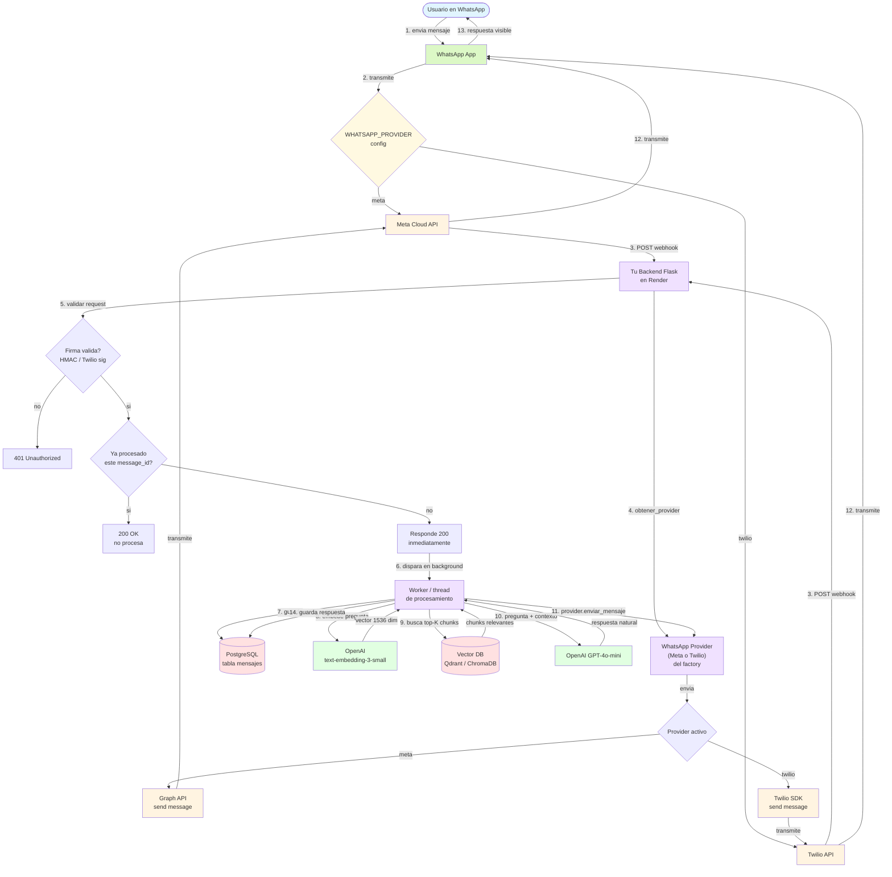
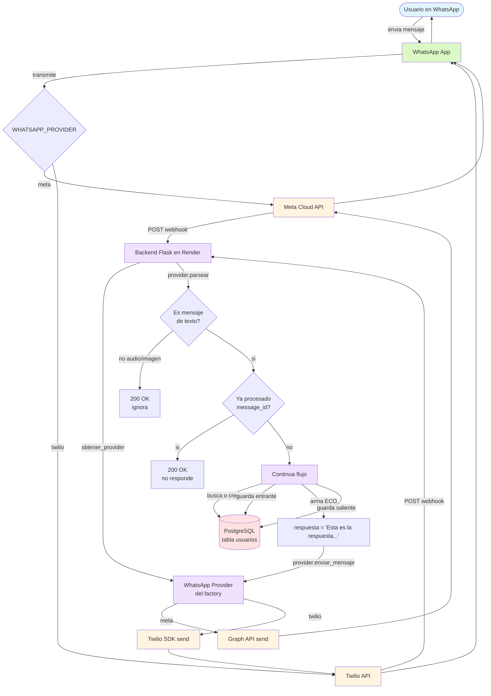
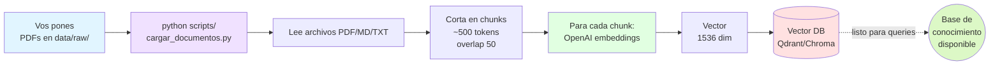
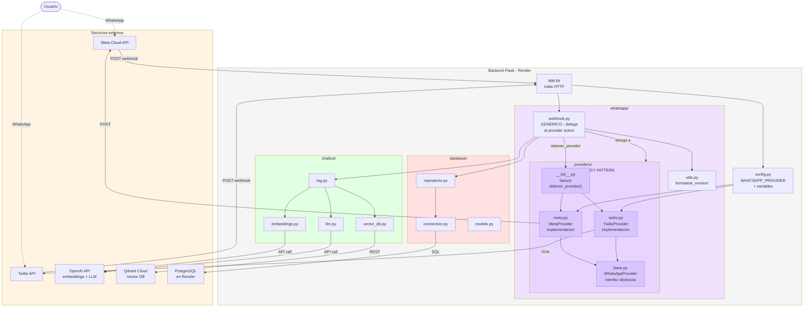
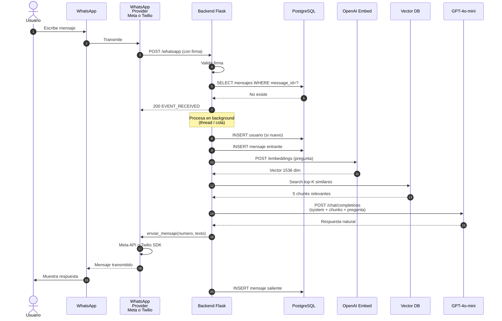
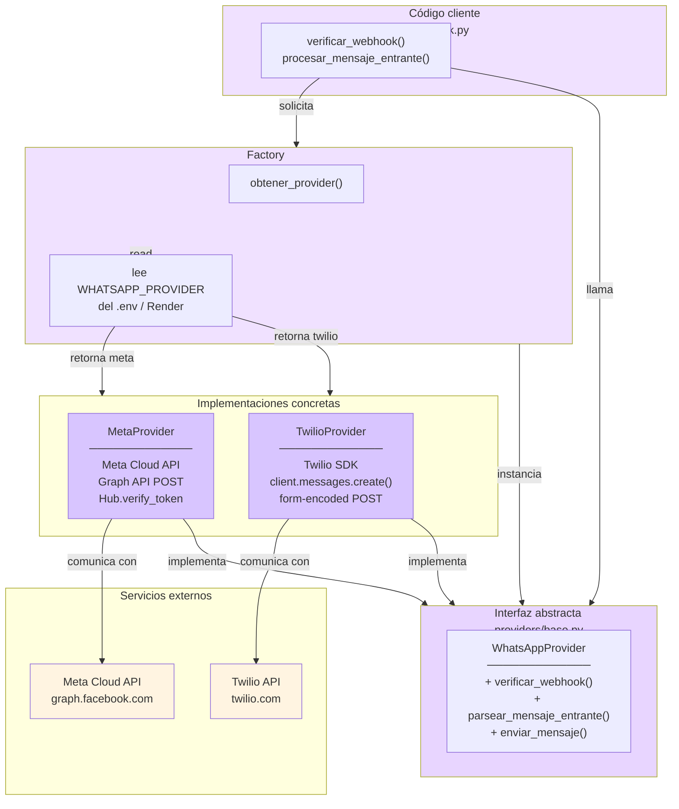

# Diagramas de Arquitectura — Chatbot Tesis

Este archivo contiene los diagramas del sistema en formato **Mermaid**, un lenguaje de texto que la mayoría de las herramientas de diagramas modernas soportan nativamente.

## Cómo usar estos diagramas

### Opción A — draw.io (recomendado)

1. Abrí https://app.diagrams.net/ (o draw.io en tu PC).
2. Menú **Arrange → Insert → Advanced → Mermaid...**
   (alternativa: **Extras → Edit Diagram → Mermaid**)
3. Copiá el bloque de código Mermaid (el contenido entre las ` ``` ` de cada sección, **sin la palabra `mermaid` ni los acentos graves**).
4. Pegalo en el cuadro y click **Insert**.
5. draw.io te lo renderiza como diagrama editable: podés mover cajas, cambiar colores y exportar como PNG/SVG/PDF para tu tesis.

### Opción B — Mermaid Live Editor (vista previa rápida)

1. Abrí https://mermaid.live/.
2. Pegá el código en el panel izquierdo.
3. Te lo renderiza en vivo a la derecha.
4. Botón "Actions → PNG/SVG" para descargarlo.

### Opción C — VS Code (vista previa local)

Instalá la extensión **"Markdown Preview Mermaid Support"** y al abrir este archivo con `Ctrl+Shift+V` ves todos los diagramas renderizados.

### Opción D — GitHub

Si pusheás este archivo a un repo público, GitHub renderiza los Mermaid automáticamente al verlo online.

---

## 1. Flujo COMPLETO — Recepción y respuesta de un mensaje (sistema final, Etapa 3+)

> Este es el flujo end-to-end con todos los componentes. **Ahora soporta Meta o Twilio** según la configuración de `WHATSAPP_PROVIDER`. El diagrama muestra "WhatsApp Provider" como abstracción.



---

## 2. Flujo ACTUAL — Recepción de un mensaje (Etapa 2, sin IA todavía)

> Es lo que tenés AHORA con la Etapa 2 funcionando. También soporta Meta o Twilio mediante el provider abstracto.



---

## 3. Ingesta de conocimiento (proceso OFFLINE que corrés vos)

> Este es el script `scripts/cargar_documentos.py` que vas a tener en la Etapa 3. NO se ejecuta automáticamente: vos lo corrés cuando agregás info nueva a la base de conocimiento.



---

## 4. Arquitectura de componentes (vista de "cajas")

> Cómo se organizan los módulos del backend. **INCLUYE** la nueva carpeta `whatsapp/providers/` con el patrón Strategy que permite Meta o Twilio sin tocar el código.



---

## 5. Secuencia detallada (vista temporal)

> Variante del diagrama 1 pero como **diagrama de secuencia**, mostrando el orden temporal explícito de cada llamada. Muy claro para defender la decisión de "responder 200 antes de procesar".



---

## 6. Arquitectura de Providers — Patrón Strategy

> Diagrama que explica específicamente cómo funciona el sistema multi-provider. Útil para defender en la tesis la decisión arquitectónica de desacoplamiento.



---

## Notas para la defensa

Cuando expliques estos diagramas en tu tesis, los puntos clave a destacar:

### General

1. **Separación entre "recibir" y "enviar"**: el webhook (proveedor → vos) y la API de envío (vos → proveedor) son dos canales distintos, no una conexión bidireccional.

2. **Por qué responder 200 antes de procesar**: el proveedor (Meta o Twilio) tiene timeout de ~10s. Si la IA tarda 5s + cold start de Render 30s, el proveedor da timeout y reintenta → mensajes duplicados. Responder 200 inmediatamente y procesar en background lo evita.

3. **Doble base de datos**: la **relacional** (Postgres) guarda usuarios y mensajes. La **vectorial** (Qdrant) guarda el conocimiento embebido. **No se sustituyen**, son complementarias.

4. **RAG vs. preguntar directo a la LLM**: el RAG (pasos 7-9) garantiza que el bot responda **solo con tu información real** y diga "no sé" cuando no tenga el dato, en vez de inventar. Es el aporte central de la tesis.

### Sobre el patrón Strategy (Diagrama 6)

5. **Por qué Strategy Pattern**: 
   - El código cliente (`webhook.py`) **NO sabe** si está usando Meta o Twilio.
   - Solo conoce una **interfaz abstracta** (`WhatsAppProvider`).
   - Cada proveedor implementa esa interfaz a su manera.
   - El **factory** decide cuál instanciar según configuración.

6. **Beneficio**: el administrador futuro del bot (ej: la facultad) puede cambiar de proveedor **sin tocar código**, solo modificando una variable de entorno (`WHATSAPP_PROVIDER`). Esto demuestra:
   - **Separación de responsabilidades**: cada módulo tiene un trabajo claro.
   - **Abierto para extensión, cerrado para modificación**: agregar un nuevo proveedor (ej: 360dialog) es crear un nuevo archivo, no modificar existentes.
   - **Inversión de dependencias**: el código de alto nivel depende de abstracciones, no de implementaciones concretas.

7. **Modularidad**: los diagramas 4 y 6 muestran que `whatsapp/`, `chatbot/` y `database/` son **cajas independientes**. Cambiar de Meta a Twilio afecta solo `whatsapp/providers/`, nada más.
